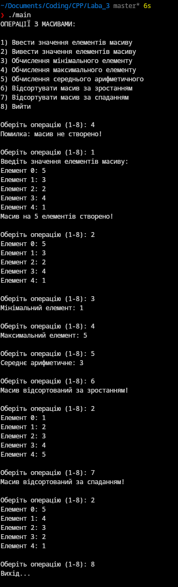

# Лабораторна робота №3

## Навчальний заклад
Відокремлений структурний підрозділ
**"Фаховий коледж інформаційних технологій**
**Національного університету “Львівська політехніка”**

**Виконав:** студент групи МТ-22
**Одарчук Олексій**

---

## Тема
**Основні операції з одновимірними масивами.**

## Мета
Ознайомлення студентів з основними операціями над одновимірними масивами в мові програмування C++. Навчитися створювати, ініціалізувати та маніпулювати масивами, а також застосовувати цикли та умови для роботи з даними у масивах.

## Завдання
Розробити програму, яка виконує базові операції над масивами:
1. Створення одновимірного масив заданої довжини (наприклад 10 значень).
2. Реалізувати операції введення та виведення елементів масиву.
3. Реалізувати функцію сортування масиву.
4. Виконати обчислення середнього арифметичного значення елементів масиву.
5. Виконати обчислення мінімального та максимального значення масиву.

---

## Код програми

Код знаходиться в декількох файлах:
- [main.cpp](main.cpp)
- [array_operations.cpp](array_operations.cpp)
- [array_operations.h](array_operations.h)

Є ще й однофайловий варіант:
- [onefile.cpp](onefile.cpp)

## Скріншот роботи програми

## Контрольні запитання

1. **Що таке одновимірний масив і як його створити в C++?**
   Це структура даних, яка зберігає фіксовану кількість елементів одного типу. Створити масив можна так: `int myArray[10];`

2. **Як можна отримати доступ до елементів масиву та змінити їх значення?**
   За допомогою індексів, починаючи з 0, наприклад, `myArray[0] = 5;` записує значення 5 в перший елемент з індексом 0, а `int value = myArray[2];` зчитує значення третього елемента з індексом 2

3. **Що станеться, якщо звернутися до елемента масиву за індексом, що виходить за межі масиву?**
   Покаже сміття, яке в пам'яті знаходиться по цьому індексу, або SIGSEGV (Address boundary error). Крч нічого хорошого

4. **Як передати масив у функцію як параметр?**
   Вказати його тип та ім'я. Наприклад: `void myFunction(int arr[])`

5. **Що таке розмір масиву, і як його можна визначити під час виконання програми?**
   Це кількість елементів, які в ньому є. Для статичних масивів можна визначити розмір через оператор `sizeof`, наприклад: `int size = sizeof(myArray) / sizeof(myArray[0]);`

6. **Як працює цикл for для ітерації через елементи масиву?**
   Цикл `for` дозволяє послідовно перебирати елементи масиву, використовуючи лічильник, який змінюється від початкового до кінцевого значення індексу

7. **Як працює цикл while і чому його можна використовувати для роботи з масивами?**
   Цикл `while` виконує код, поки умова є правдивою. Його можна використовувати, наприклад, для зчитування даних до певного знака або для пошуку елемента

8. **Які є основні переваги використання масивів для зберігання даних?**
   - Швидкий доступ до елементів за індексом
   - Ефективне використання пам'яті
   - Простота у використанні для зберігання однотипних даних

9. **Які обмеження існують при використанні статичних масивів?**
   - Фіксований розмір, який не можна змінити в runtime
   - Необхідність знати розмір масиву на етапі компіляції
